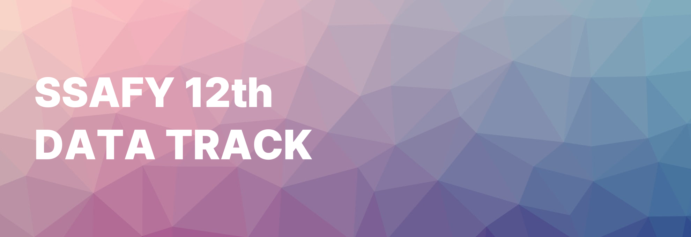

---
# SSAFY 12기 데이터 트랙 👨‍💻
 >**삼성 청년 SW 아카데미**
 데이터 트랙 첫 번째 기수

 
 

## Projects

 
 

## Side Projects
### ${\textbf{\textsf{\color{orangered}1. Cherry Picker🍒}}}$
> **가격비교 & 순수평점**을 통한 고객의 합리적 소비   
**${\textsf{\color{orangered}아이디어톤 1등🏆}}$**

 

*어디가 제일 싸지?*
<!--
${\textit{\textsf{\color{orangered}어디가 제일 싸지?}}}$
-->

- 배달 음식을 시킬 때, 여러 배달 앱을 기웃거리신 경험 있으신가요?   
**CherryPicker**가 업체의 플랫폼별 **`가격`**, **`배달팁`**, **`구독시 가격`**, **`평점`** 등을 한 눈에 비교해드립니다!

 

*5점인데 왜 이렇게 맛없어?*
<!--
${\textit{\textsf{\color{orangered}5점인데 왜 이렇게 맛없어?}}}$
-->

- 리뷰이벤트로 인해 망가진 평점 시스템   
**CherryPicker**만의 **`찐평점`** 을 통해 '협찬 평점' 아닌 '진짜 평점'을 확인하세요!

 

<table align="center">
<tr>
    <td align="center" width="35%">
        
    </td>
    <td align="center" width="65%">
        <video controls autoplay loop src="https://github.com/user-attachments/assets/befae84a-03cb-4c97-b20e-939cb0be74ff" width="100%" muted="false"></video>
    </td>
</tr>
<tr>
    <td colspan="2" align="left">
        

            

                <strong>- (Image to Text) 한국어 텍스트 인식 기술 구현 담당</strong>  
                - 캡처된 이미지로부터 텍스트를 추출  
                - 추출된 텍스트로부터 업체명, 메뉴, 가격 등을 인식  
                - 인식된 정보들을 SQL DB에 나누어 저장
            

        

    </td>
</tr>
</table>

 
 
 

### ${\textbf{\textsf{\color{yellowgreen}2. 지켜줘요! 동물의 숲🦊}}}$

> **멸종 위기 동물들을 당신은 외울 수 있을 것인가..!**   
**${\textsf{\color{yellowgreen}크리에이터 챌린지 2등🏆}}$**       
[**`플레이 하기`**](https://redbrick.land/detail-play?pid=af54812a-71e4-4667-b817-09c0d7ad15eb)

 

*크리에이터 챌린지?*

<!--
${\textit{\textsf{\color{yellowgreen}크리에이터 챌린지?}}}$
-->

- `자바스크립트 + 레드브릭`을 활용한 게임제작 대회

 

*무슨 게임인가요?*

<!--
${\textit{\textsf{\color{yellowgreen}무슨 게임인가요?}}}$
-->

- 멸종위기 동물을 쉽고 재미있게 외우자는 취지에서 제작한 게임입니다.
- 10초 동안 주어지는 동물카드를 외우고, 무엇이 나왔었는지를 맞추면 **VICTORY!**

*(레벨 디자인이 되어 있었으나 시간상의 문제로 비활성화)*

 

<!--
| |
|---|
| - **아이디어 및 SW구현 담당**   - 주제 및 게임 메인 아이디어 구상   - 자바스크립트를 이용하여 게임 로직 구성   - 전반적 모델링, 맵 디자인 담당 |
-->

<table align="center">
<tr>
    <td align="center" width="90%">
        
    </td>
</tr>
<tr>
    <td align="center" width="90%">
        

            

                <strong>- 아이디어 및 SW구현 담당</strong>  
                - 주제 및 게임 메인 아이디어 구상  
                - 자바스크립트를 이용하여 게임 로직 구성  
                - 전반적 모델링, 맵 디자인 담당
            

        

    </td>
</tr>
</table>

 
 
 
 
 
 

**SSAFY 내부 약관과 규정에 의거하여 교재 및 코드는 포함되어 있지 않습니다.**
