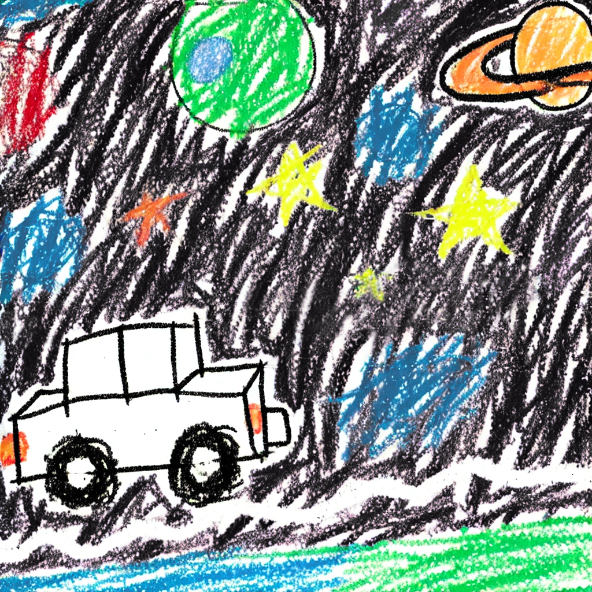

# 로봇퀘스트
> **파이썬을 활용한 로봇제어**   
모터제어, 색상센서, 거리센서를 활용하여 주어진 미션들을 해결하라   

`#라인트레이싱` `#알고리즘` `#로봇` `#파이썬`

 

  
  
<em>(규정으로 인한 대체 AI 이미지,,,)  컬러센서를 이용해서 라인트레이서를 했다. 로봇팔을 제어해서 우주 쓰레기도 치웠다.   어려진 기분이 들어 신나는 하루였다.</em>

  

     

**SSAFY 내부 약관과 규정에 의거하여 코드는 포함되어 있지 않습니다.**
